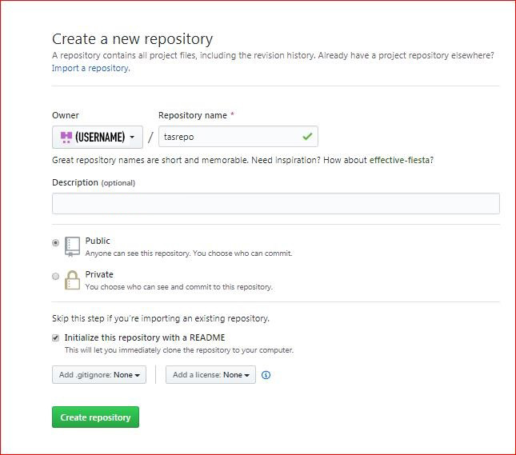
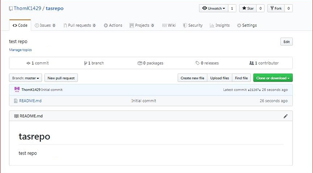
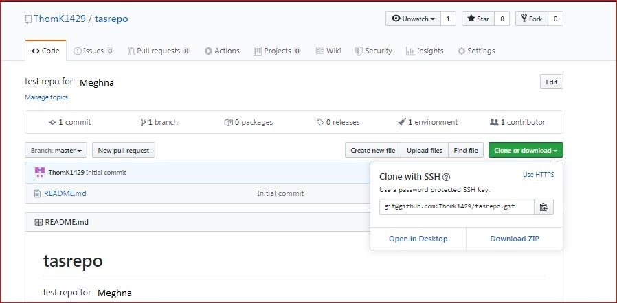
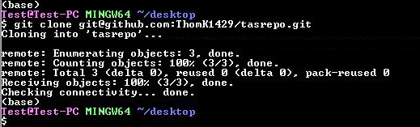
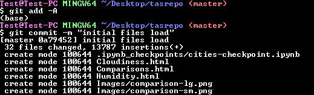
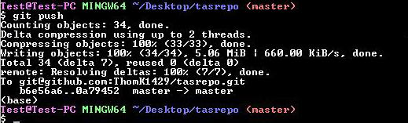
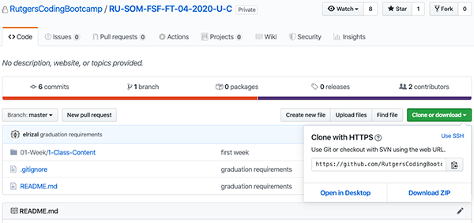
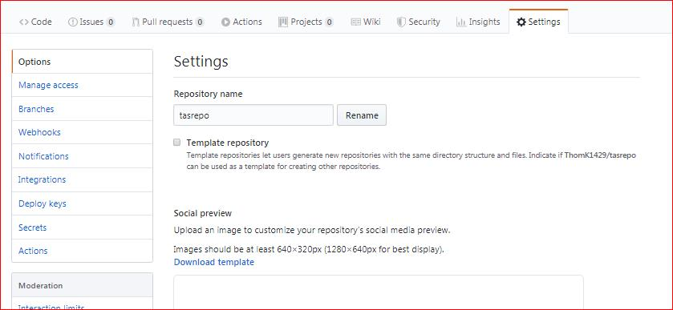
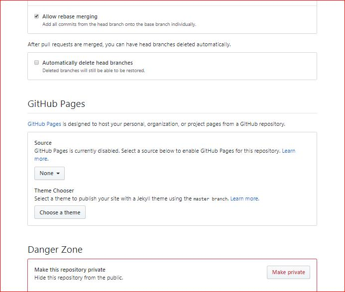

## Creating a New Repository
1.) Go to github.com -> Select the **+** on the top right -> New repository.

**Make sure to check  "start with a read me"  and  "add gitignore"  set to "Node". The gitignore will filter out files we don't need when we later update. Node will be used later in the course.**

2.) Once you've set that up you should get an overview to: 

3.) Select the "clone or download" and choose to clone with SSH. Copy this link.

4.) Open your Command Line and type  `git clone the-link-you-copied`

5.) Then change into your cloned repository by typing `cd the-name-of-the-repo`. Whenever you clone your repository, you won't actually be switched to your repo right off the bat.

6.) If you make changes to your code or make new files, start the update with `git add .` in your command line. This starts your commit.

7.) Then type `git commit -m "a message to describe a change you made"` Note any files being added. If you get an "untracked files" warning you can follow the suggestion to make sure all the files you intend to send up are there.

and `git push`:

## Pulling from an existing repository 
Go over to the link for the repository and clone with SSH:

Open up you CLI and `git clone SSH-copied`. Change directory into it type `git pull`

*Potential errors:*  If you modified files at any point and then request a pull, you'll be asked to commit the changes. Since you aren't a collaborator on the repository, you can just store your accidental changes or work via `git stash`. You typically won't use this in a work-setting, but for the class we'll just put aside any edits.

## Deploying your repository 
1.) In the repository that you want to make public (deploy) go to "Settings" from the same view above. 

2.) Scroll down to "Github Pages". Set the "Source" from "none" to "master" since the code you want live will be on this branch. You should then see the live link appear above the section along the lines of **your-name .github.io/the-repo-name/.** 

*Important: make sure you have an "index.html" file in your repository, otherwise you will only be shown the read-me file when you select to deploy. 
