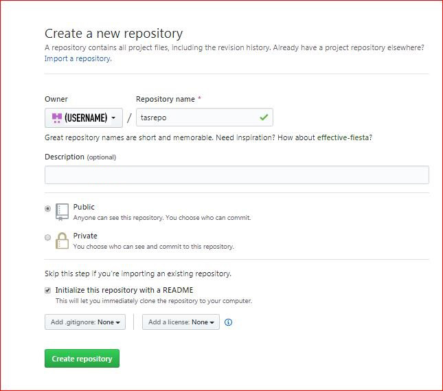
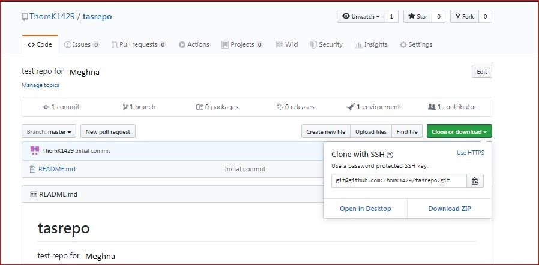
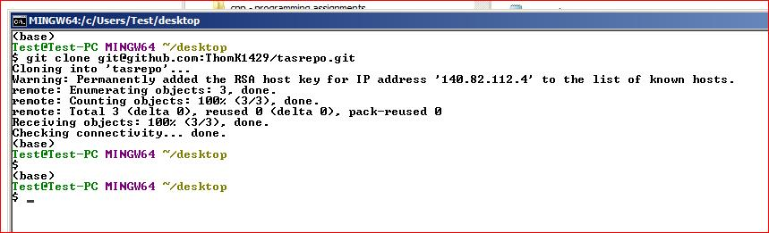
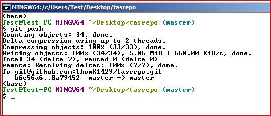
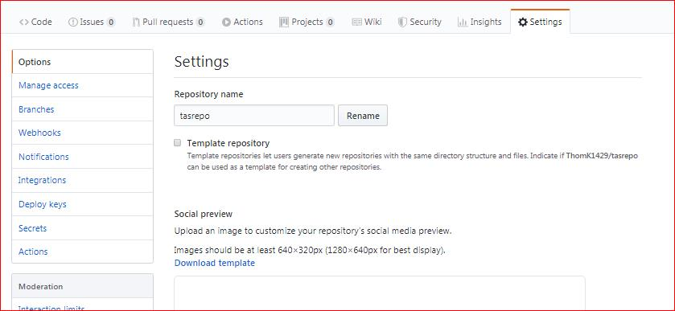

## Creating a New Repository
1.) Go to github.com -> + -> New repository 
** Make sure to check "start with a read me" and "add gitignore" set to "Node"

2.) Once you've set that up you should get an overview to: 

3.) Select the "clone or download" and copy the SSH address:

4.) Open your Command Line and type  `git clone the-ssh-address`

5.) Then change into your cloned repository by typing `cd the-name-of-the-repo`. Whenever you clone your repository, you won't actually be switched to your repo right off the bat.

6.) if you make changes to your code or make new files, start the update with `git add .` in your command line.

7.) Then `git commit -m "whatever you changed"` and `git push`

## Deploying your repository 
1.) In the repository that you want to make public (deploy) go to "Settings" from the same view above. Then scroll to this: 

2.) Set the source to "master" since the code you want live will be on this branch.

*Important: make sure you have an "index.html" file in your repository, otherwise you will only be shown the read-me file when you select to deploy. 