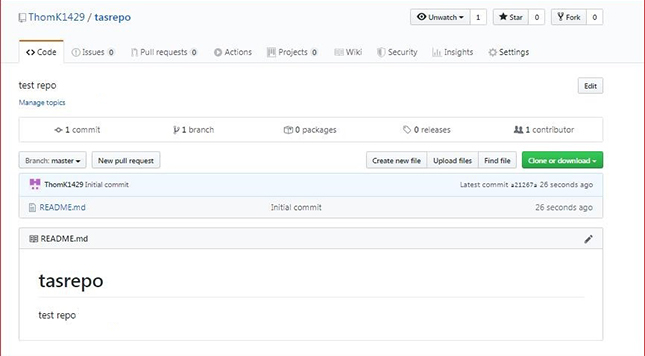

## Creating a New Repository
1.) Go to github.com -> + -> New repository 
** Make sure to check "start with a read me" and "add gitignore" set to "Node"

2.) Once you've set that up you should get an overview to: 

## Deploying your repository 
1.) In the repository that you want to make public (deploy) go to "Settings" from the same view above. Then scroll to this: 
